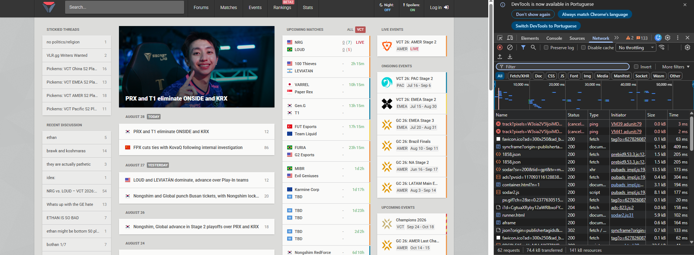
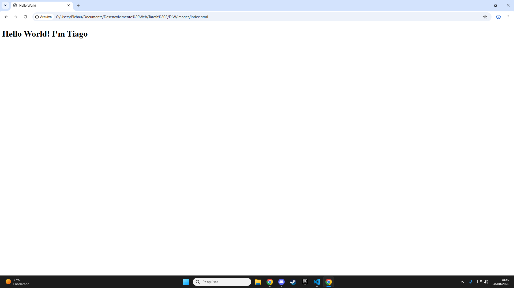

# DIW
Projetos de Desenvolvimento de Interface Web

Aluno

Nome: Tiago Henrique Gomes Formiga
Matricula: 926142

Inspeção de conexão

Abaixo está o print da inspeção realizada utilizando as ferramentas de desenvolvedor do navegador, na aba Network (Rede).   

Resultado do index.html

Abaixo está o print do resultado apresentado no navegador para o arquivo

